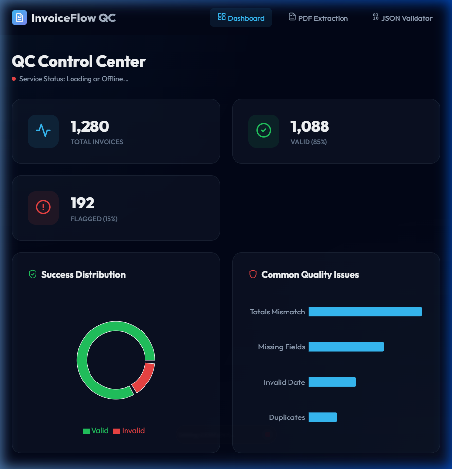
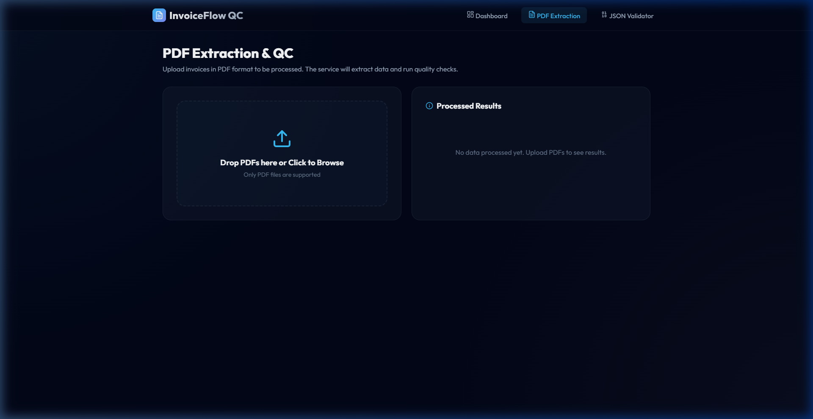
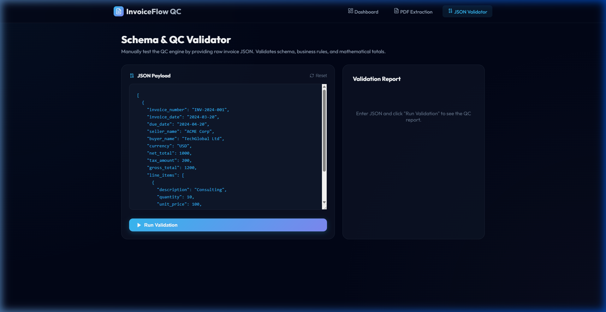
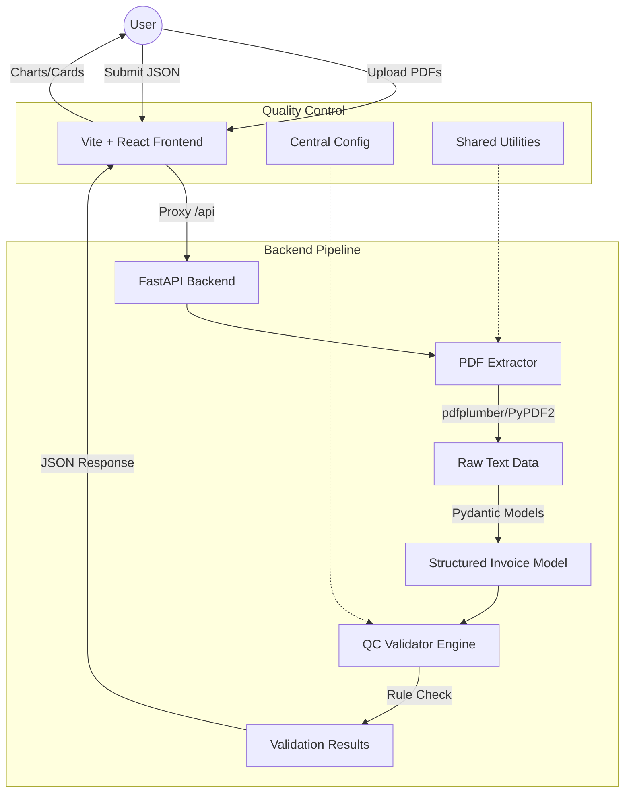

# 📄 InvoiceFlow — AI-Powered Invoice QC Service

[](https://fastapi.tiangolo.com/)
[](https://reactjs.org/)
[](https://vitejs.dev/)
[](https://www.docker.com/)
[](https://www.python.org/)
[](https://docs.pydantic.dev/)

**InvoiceFlow** is a production-ready microservice designed to extract, validate, and quality-check invoices from PDF documents. It combines AI-driven OCR extraction with a robust rule-based validation engine to ensure data integrity in financial pipelines.

---

## 🖼️ Screenshots & Demo

### 🎬 Live Demo


### Dashboard

*Real-time analytics showing validation success rates and common QC failure types.*

### PDF Extraction

*Drag-and-drop interface for batch PDF processing with instant extraction results.*

### JSON Validator

*Advanced schema and business rule tester for raw invoice payloads.*

---

## 🏗️ Architecture



---

## 🧮 QC Validation Logic

The service runs four layers of quality checks on every invoice:

| Category | Check Type | Description |
|---|---|---|
| **Presence** | `missing_field` | Ensures `invoice_number`, `date`, `seller`, and `buyer` exist. |
| **Format** | `invalid_format` | Validates ISO dates and supported currencies via central settings. |
| **Business** | `totals_mismatch` | Checks if `net_total + tax_amount == gross_total` (Configurable tolerance). |
| **Business** | `sum_mismatch` | Verifies that the sum of line items matches the `net_total`. |
| **Anomaly** | `duplicate` | Flags if the same (Number, Seller, Date) combo has been seen. |

---

## 🚀 Quick Start

### 🐳 Docker Compose (Recommended)
```bash
docker-compose up --build
```
- **Frontend**: http://localhost:5174
- **Backend API**: http://localhost:8000
- **API Docs**: http://localhost:8000/docs

### 💻 Local Development

#### 1. Backend Setup
```bash
python -m venv .venv
source .venv/bin/activate  # .venv\Scripts\activate on Windows
pip install -r requirements.txt
python -m uvicorn invoice_qc.api:app --reload
```

#### 2. Frontend Setup
```bash
cd frontend
npm install
npm run dev
```

---

## 📂 Project Structure

```text
.
├── invoice_qc/          # FastAPI Backend
│   ├── api.py           # API Endpoints & Global Error Handling
│   ├── extractor.py     # OCR & Text Extraction logic
│   ├── validator.py     # QC Validation Engine
│   ├── models.py        # Pydantic v2 Models (Source of Truth)
│   ├── config.py        # Settings & Business Rules
│   └── utils/           # Shared parsing & utility modules
├── frontend/            # Vite + React Application
│   ├── src/pages/       # Dashboard, Upload, Validator
│   ├── src/components/  # Shared UI Components (InvoiceResultCard, etc.)
│   ├── src/hooks/       # Service hooks (useInvoiceOps)
│   └── src/api/         # Axios client with JSDoc types
├── docs/                # Documentation & Screenshots
├── sample_pdfs/         # Test invoices for extraction
└── docker-compose.yml   # Multi-container orchestration
```

---

## 🔌 API Reference

| Endpoint | Method | Description |
|---|---|---|
| `/extract-and-validate-pdfs` | `POST` | Upload PDF files for extraction + QC. |
| `/validate-json` | `POST` | Validate raw invoice JSON payload. |
| `/health` | `GET` | Service status check. |

### Payload Example (JSON Validator)
```json
[
  {
    "invoice_number": "INV-001",
    "invoice_date": "2024-03-20",
    "seller_name": "Tech Corp",
    "buyer_name": "Global Inc",
    "net_total": 100.0,
    "tax_amount": 10.0,
    "gross_total": 110.0
  }
]
```

---

## 🧪 Code Quality Standards

The service has undergone a comprehensive 7-track cleanup pass:
- **DRY Architecture**: Shared parsing utilities and UI components.
- **Type Safety**: Full Python type hints (Pydantic) and Frontend JSDoc.
- **Resilience**: Global exception handling and standardized error responses.
- **Configurability**: Business rules (tolerances, currencies) are fully configurable via `.env`.

---

## ⚖️ License
Distributed under the MIT License. See `LICENSE` for more information.
